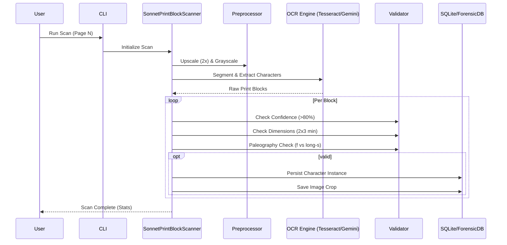

# CODEFINDER Architecture

```mermaid
graph TD
    subgraph Frontend [Frontend Layer (Port 3000)]
        UI[React Dashboard]
        D3[D3.js Visualization]
        AntD[Ant Design Components]
        UI --> D3
        UI --> AntD
    end

    subgraph API [API Layer (Port 8000)]
        FastAPI[FastAPI Gateway]
        Auth[JWT Authentication]
        FastAPI --> Auth
    end

    Frontend -->|HTTP/REST| API

    subgraph Services [Service Layer]
        subgraph Forensic_Engine [Forensic & OCR Engine]
            Scanner[SonnetPrintBlockScanner]
            OCR[OCR Factory]
            Tesseract[Tesseract v5]
            Gemini[Gemini Vision]
            InkDot[Ink Dot Analyzer]
            Geo[Geometric Analyzer]
            
            Scanner --> OCR
            OCR --> Tesseract
            OCR --> Gemini
            Scanner --> InkDot
            Scanner --> Geo
        end

        subgraph Analysis_Engine [Cryptographic & Prophetic Engine]
            Gematria[Gematria Engine]
            ELS[ELS Analyzer]
            Cipher[Cipher Detector]
            Prophetic[Prophetic Analyzer]
            BardCode[BardCode/Sacred Geo]
            
            Prophetic --> ELS
            Prophetic --> Gematria
        end

        subgraph Utilities [Utility Services]
            PDF[PDF Processor]
            ImgProc[Image Processor]
            Transliterate[Transliteration Service]
            
            ELS --> Transliterate
            Scanner --> ImgProc
        end
    end

    FastAPI --> Scanner
    FastAPI --> Gematria
    FastAPI --> ELS
    FastAPI --> Cipher
    FastAPI --> Prophetic
    FastAPI --> BardCode

    subgraph Data [Data Layer]
        Postgres[(PostgreSQL:5432)]
        Redis[(Redis:6379)]
        SQLite[(Forensic SQLite)]
        
        FileSystem[File System / Archive]
    end

    Scanner --> SQLite
    Scanner --> FileSystem
    Analysis_Engine --> Postgres
    FastAPI --> Redis
```

## Scanner Pipeline Detail


