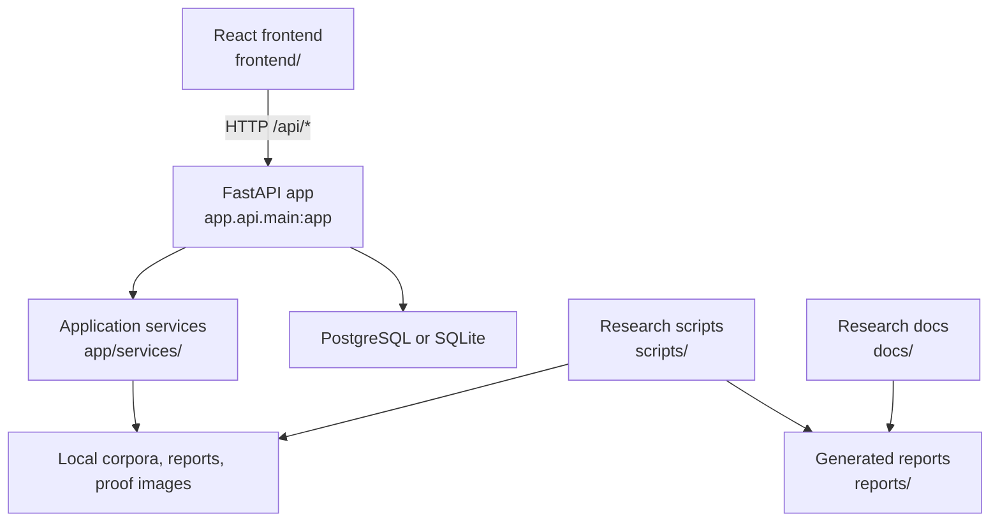
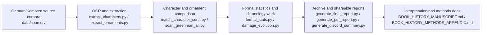

# CODEFINDER Architecture

This repository is a single monorepo with two active responsibilities:

1. Product runtime: a FastAPI backend and React frontend for document-oriented analysis workflows.
2. Historical-print research: a set of reproducible pipelines and reports, with German/Kempten as the active research lane.

## Lane Overview

| Lane | Status | Primary locations | Notes |
| --- | --- | --- | --- |
| Product | Active | `app/`, `frontend/`, `tests/` | Canonical runtime stays `app.api.main:app` with API routes under `/api/*`. |
| German/Kempten research | Active priority | `scripts/`, `docs/BOOK_HISTORY_MANUSCRIPT.md`, `docs/BOOK_HISTORY_METHODS_APPENDIX.md`, `reports/shareable/`, `reports/final_report/` | Current shareable and archive outputs must stay aligned. |
| Shakespeare research | Secondary canonical | `scripts/`, `reports/shakespeare/`, `docs/SHAKESPEARE_MANUSCRIPT.md`, `docs/SHAKESPEARE_METHODS_APPENDIX.md` | Canonical package exists, but it remains diagnostic-only rather than a finished attribution case. |
| Legacy exploratory tools | Internal legacy | `app/api/routes/research.py`, `frontend/src/pages/research/`, `scripts/legacy/`, `archive/research_scripts/` | Preserved for auditability and secondary use, but not part of the default product workflow. |
| Exploratory archive | Archived | `archive/`, `docs/RESEARCH_COMPENDIUM.md` | Preserved for audit history; not part of the active roadmap. |

## Runtime Architecture

```mermaid
graph TD
    Frontend["React frontend<br/>frontend/"] -->|"HTTP /api/*"| API["FastAPI app<br/>app.api.main:app"]
    API --> Services["Application services<br/>app/services/"]
    API --> DB["PostgreSQL or SQLite"]
    Services --> Files["Local corpora, reports, proof images"]
    ResearchScripts["Research scripts<br/>scripts/"] --> Files
    ResearchScripts --> Reports["Generated reports<br/>reports/"]
    ResearchDocs["Research docs<br/>docs/"] --> Reports
```

### Runtime contract

- Backend entrypoint: `uvicorn app.api.main:app`
- Public docs: `/api/docs`
- Health endpoint: `/api/health`
- Frontend dev server: `frontend/` on port `3000`
- Docker stack: backend, frontend, PostgreSQL

Existing compatibility routes may remain in code, but the contract above is the one contributors should treat as stable.

The exploratory research surface under `/api/research/*` remains runnable as an internal legacy lane, but it should not drive product copy, primary navigation, or roadmap priorities.

## Research Architecture

### German/Kempten pipeline

```mermaid
graph LR
    Sources["German/Kempten source corpora<br/>data/sources/"] --> OCR["OCR and extraction<br/>extract_characters.py / extract_ornaments.py"]
    OCR --> Matching["Character and ornament comparison<br/>match_character_sorts.py / scan_greenman_all.py"]
    Matching --> Stats["Formal statistics and chronology work<br/>formal_stats.py / damage_evolution.py"]
    Stats --> Reports["Archive and shareable reports<br/>generate_final_report.py / generate_pdf_report.py / generate_discord_summary.py"]
    Reports --> Manuscript["Interpretation and methods docs<br/>BOOK_HISTORY_MANUSCRIPT.md / BOOK_HISTORY_METHODS_APPENDIX.md"]
```

Active evidentiary base:

- `reports/shareable/CODEFINDER_Discord_Summary.pdf`
- `reports/final_report/summary.txt`
- `docs/BOOK_HISTORY_MANUSCRIPT.md`
- `docs/BOOK_HISTORY_METHODS_APPENDIX.md`

Completed inputs now in place:

- Manual review ledger completed for the top `60` character-sort rows
- Damage chronology rerun updated to corrected local source dates and kept diagnostic-only

Remaining blockers before the German lane is fully stable:

- No publication-grade negative control has yet been accepted
- Outward-facing figures and report wording still need to stay aligned with the manuscript's caution
- Stronger same-object language still requires specialist bibliographical review

### Shakespeare lane

The Shakespeare work remains important but secondary. It now has a canonical external-safe diagnostic package under `reports/shakespeare/`, with `docs/forensic_methodology_critique.md` retained as the control document. Any future stronger claim still requires a better page map, a documented higher-resolution rerun if image-level claims matter, and specialist bibliographical review.

## Storage Model

- `data/` is the managed local store for source corpora, configuration, and forensic databases.
- `reports/` is a generated artifact store, not a long-term hand-edited document area.
- `docs/` holds durable human-readable contracts, manuscripts, and reproducibility material.
- `archive/` preserves retired or exploratory work without advertising it as active functionality.

See `docs/REPO_INDEX.md`, `docs/REPO_CONTRACT.md`, `reports/README.md`, and `data/README.md` for the operating rules attached to that storage model.
